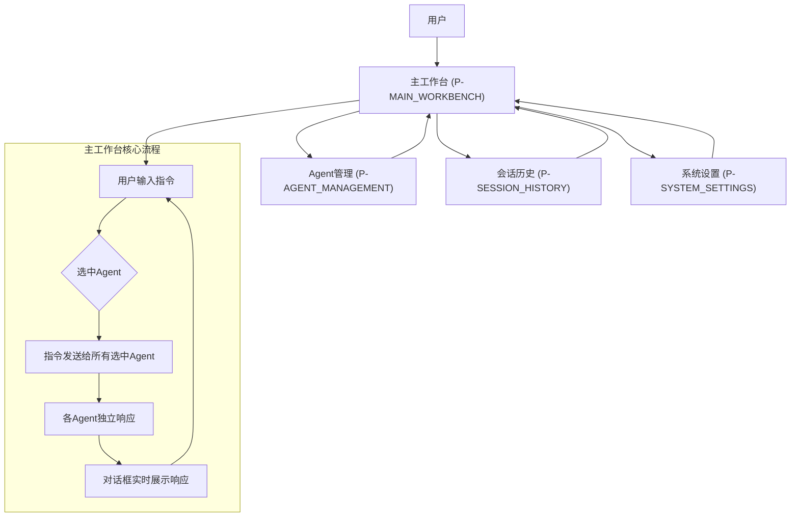
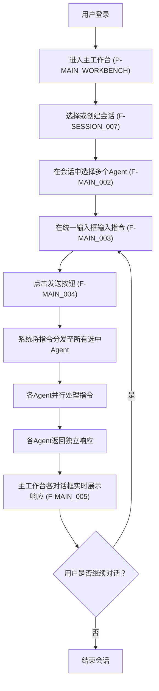
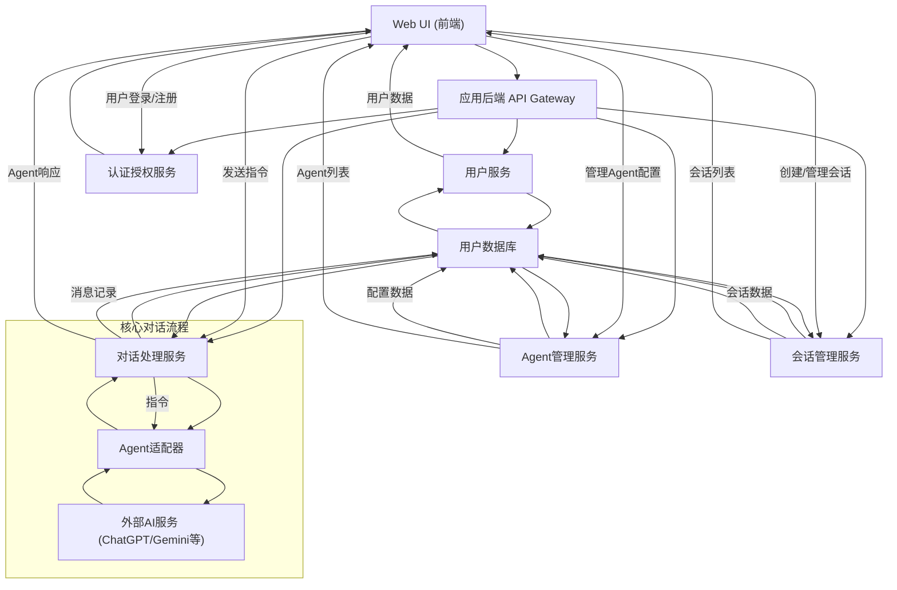

# RoundTable AI 产品需求文档

## 1. 产品概述

### 1.1 产品名称与定位

*   **产品名称:** RoundTable AI
*   **产品定位:** RoundTable AI 是一款专为个人开发者设计的Web端效率工具，旨在通过集成多AI Agent、提供并行对话能力和高效会话管理，解决开发者在代理协作和信息整合方面沟通不畅的核心痛点。

### 1.2 产品应用语言

*   **产品应用语言:** RoundTable AI 面向中文用户。

### 1.3 产品愿景与目标

*   **产品愿景:** 成为个人开发者首选的智能协作中心，赋能开发者更高效地利用AI Agent完成复杂任务，提升创新能力。
*   **产品目标:**
    *   提升多Agent协作效率：通过提供统一的对话入口和并行交互能力，显著减少Agent切换和信息整合的时间成本。
    *   优化Agent管理体验：提供直观的Agent管理界面，方便开发者配置、选择和使用不同的AI Agent。
    *   实现会话信息可追溯：通过完善的会话管理功能，确保所有对话历史可查阅、可管理，支持知识沉淀。
    *   提供个性化工作环境：允许用户自定义系统设置，以适应不同的工作流和偏好。

### 1.4 产品使用终端

*   **主要终端:** Web端桌面应用
*   **浏览器支持:** Chrome 90+、Firefox 88+、Safari 14+、Edge 90+
*   **分辨率支持:** 768x480及以上分辨率，最佳体验为1920x1080
*   **响应式适配:** 支持768px以上的所有桌面和平板设备，优先保证桌面端体验。

### 1.5 核心价值主张

RoundTable AI 提供一个集中式的多Agent智能协作平台，允许个人开发者通过一次输入，同时与多个AI Agent进行并行对话，并实时接收和整合多方响应。它简化了Agent的选定、配置与会话管理流程，极大地提升了开发者在多AI Agent场景下的工作效率和信息整合能力。

### 1.6 目标用户群体分析

*   **主要用户:** 个人开发者
*   **用户画像:**
    *   技术背景：熟悉编程语言、开发工具和AI技术基础。
    *   痛点：
        *   需要与多个AI Agent（如代码助手、文档分析、创意生成、问题解答等）交互以完成开发任务。
        *   频繁在不同Agent界面间切换，导致效率低下，上下文丢失。
        *   难以有效管理和整合来自不同Agent的响应信息。
        *   希望有一个统一的平台来组织和回顾与AI Agent的协作过程。
    *   需求：
        *   一个能同时与多个Agent对话的界面。
        *   方便的Agent选择和管理功能。
        *   对会话进行分类、搜索和归档的能力。
        *   个性化的工作环境配置。

### 1.7 市场需求与竞品简析

*   **市场需求:** 随着AI模型和Agent的普及，开发者在日常工作中越来越依赖各类AI工具。然而，市面上多数工具专注于单一Agent的交互，缺乏一个能高效协调和管理多个AI Agent并行工作的平台。开发者迫切需要一个能将多Agent协作流程集成化的效率工具。
*   **竞品简析:**
    *   **通用聊天机器人平台:** 如ChatGPT, Bard等，主要支持单Agent对话，缺乏多Agent并行交互和集中管理能力。
    *   **开发辅助工具:** 如GitHub Copilot，集成于IDE，但仍是单一Agent模式，无法进行多Agent横向协作。
    *   **项目管理工具:** 如Jira, Trello等，侧重于任务管理，不具备AI Agent直接对话与协作的能力。
*   **RoundTable AI优势:** 专注于多Agent并行对话与集中管理，提供独特的一次输入多Agent输出功能，填补了市场空白，显著提升开发者在AI驱动工作流中的效率。

### 1.8 浏览器兼容性要求

*   **主流浏览器支持:** 必须支持最新稳定版 Chrome、Firefox、Safari、Edge。
*   **最低分辨率:** 桌面端最低支持分辨率为 1024x768。
*   **最佳体验分辨率:** 推荐 1920x1080 及更高分辨率。
*   **性能优化:** 确保在大数据量和多Agent并行工作时，页面加载和交互响应迅速。

## 2. 功能规格

### 2.1 功能详述

#### 2.1.1 主工作台 (P-MAIN_WORKBENCH)

| 功能ID | 功能名称 | 功能描述 | 优先级 |
|--------|---------|---------|--------|
| F-MAIN_001 | 多对话框界面展示 | 主工作台页面必须以网格或平铺形式展示多个独立的Agent对话框，每个对话框代表一个独立的Agent会话。用户可根据屏幕尺寸和偏好调整对话框布局或数量。 | P0 |
| F-MAIN_002 | Agent选择与切换 | 必须支持用户在主工作台中为每个对话框独立选择或切换AI Agent。提供已配置Agent列表供用户快速选择。 | P0 |
| F-MAIN_003 | 用户输入区 | 必须提供一个统一的用户输入框，用户在此输入对话指令。输入框需支持多行文本输入、历史输入记录和常用快捷键。 | P0 |
| F-MAIN_004 | 一次输入多Agent对话 | 用户在统一输入框输入指令后，点击发送，该指令必须同时发送给所有当前选中的Agent对话框，并实时接收和展示各Agent的独立响应。 | P0 |
| F-MAIN_005 | 对话内容实时展示 | 各Agent对话框必须实时展示其Agent的响应内容，包括文本、代码块、图片等。对话内容必须支持滚动、复制、以及针对代码块的语法高亮。 | P0 |
| F-MAIN_006 | 对话框操作 | 每个Agent对话框必须提供独立操作按钮，如清空当前对话、查看Agent详情、关闭对话框等。 | P1 |
| F-MAIN_007 | 会话切换 | 主工作台必须支持用户在左侧菜单或顶部快速切换不同的会话。切换后，主内容区必须加载对应会话的对话历史和Agent配置。 | P0 |

#### 2.1.2 Agent管理 (P-AGENT_MANAGEMENT)

| 功能ID | 功能名称 | 功能描述 | 优先级 |
|--------|---------|---------|--------|
| F-AGENT_001 | Agent列表与管理 | 必须提供Agent列表页面，展示所有已添加的Agent，包含Agent名称、类型、描述、状态等信息。支持对Agent进行新增、编辑、删除、启用/禁用操作。 | P0 |
| F-AGENT_002 | Agent详情与配置 | 必须提供Agent详情页面，用户可在此配置Agent的具体参数，如API Key、模型选择、角色设定、上下文长度等。配置项必须根据Agent类型动态调整。 | P0 |
| F-AGENT_003 | Agent导入/导出 | 必须支持用户导入或导出Agent的配置，以便于分享或备份。 | P1 |
| F-AGENT_004 | 预设Agent模板 | 必须提供一系列预设的Agent模板，如代码生成助手、文档分析助手、创意写作助手等，用户可基于模板快速创建Agent。 | P1 |

#### 2.1.3 会话管理 (P-SESSION_HISTORY)

| 功能ID | 功能名称 | 功能描述 | 优先级 |
|--------|---------|---------|--------|
| F-SESSION_001 | 会话列表与搜索 | 必须提供会话历史列表，展示所有会话，包含会话名称、创建时间、最后活跃时间、参与Agent等信息。支持按关键词搜索、按时间排序和筛选。 | P0 |
| F-SESSION_002 | 会话重命名与归档 | 必须支持用户对会话进行重命名、归档（隐藏但可恢复）和删除操作。归档的会话必须在独立的列表中展示。 | P0 |
| F-SESSION_003 | 会话内容导出 | 必须支持用户将整个会话的对话内容导出为常见格式（如Markdown、PDF、TXT）。 | P1 |
| F-SESSION_004 | 会话星标/收藏 | 必须支持用户对重要会话进行星标或收藏，以便于快速查找。 | P1 |

#### 2.1.4 系统设置 (P-SYSTEM_SETTINGS)

| 功能ID | 功能名称 | 功能描述 | 优先级 |
|--------|---------|---------|--------|
| F-SETTING_001 | 用户偏好设置 | 必须提供用户偏好设置，包含界面主题（亮/暗）、字体大小、通知设置、默认Agent加载行为等。 | P0 |
| F-SETTING_002 | 账号安全设置 | 必须提供账号安全设置，包含修改密码、绑定邮箱/手机、两步验证等功能。 | P0 |
| F-SETTING_003 | API密钥管理 | 必须提供集中管理用户所有API密钥的入口，确保密钥安全存储和管理。 | P1 |
| F-SETTING_004 | 数据与隐私设置 | 必须提供数据存储、隐私政策、数据删除等相关设置和说明。 | P1 |

### 2.2 功能模块间的关系图

## 3. 用户流程

### 3.1 用户旅程地图

| 阶段 | 用户行为 | 情绪 | 痛点 | 产品功能支撑 | 关键触点 | 期望收益 |
| :--- | :------- | :--- | :--- | :----------- | :------- | :------- |
| **初次接触** | 了解产品功能、注册/登录 | 好奇、期待 | 现有AI工具割裂、效率低下 | 登录/注册（P-AUTH）、产品介绍、Agent模板 | 官网、注册页 | 发现新工具、建立账号 |
| **Agent配置** | 添加/配置常用Agent | 积极、专注 | 不知如何集成、参数复杂 | Agent列表与管理（F-AGENT_001）、Agent详情与配置（F-AGENT_002）、预设Agent模板（F-AGENT_004） | Agent管理页面 | 快速构建个性化AI工具集 |
| **日常使用** | 启动多Agent对话、输入指令、查看响应 | 高效、满意 | 多Agent切换麻烦、信息整合困难 | 多对话框界面（F-MAIN_001）、Agent选择（F-MAIN_002）、统一输入（F-MAIN_003）、一次输入多Agent对话（F-MAIN_004）、实时展示（F-MAIN_005） | 主工作台（P-MAIN_WORKBENCH） | 提高任务处理效率、并行获取多方意见 |
| **会话管理** | 查找历史会话、回顾内容 | 有序、轻松 | 历史记录散乱、难以追踪 | 会话列表与搜索（F-SESSION_001）、会话重命名与归档（F-SESSION_002）、会话内容导出（F-SESSION_003） | 会话历史（P-SESSION_HISTORY） | 知识沉淀、快速回顾 |
| **个性化** | 调整系统设置、偏好 | 舒适、掌控 | 界面不适应、功能不顺手 | 用户偏好设置（F-SETTING_001）、账号安全设置（F-SETTING_002） | 系统设置（P-SYSTEM_SETTINGS） | 提升使用体验、安全保障 |

### 3.2 关键业务流程图

#### 3.2.1 一次输入，多Agent并行对话流程

### 3.3 各场景下的用户操作步骤

#### 3.3.1 场景一：开始一个多Agent协作任务

1.  **用户操作:** 打开浏览器，访问 RoundTable AI 平台。
    *   **系统响应:** 显示登录/注册页面（P-AUTH）。
2.  **用户操作:** 输入账号密码进行登录。
    *   **系统响应:** 成功登录后，跳转至主工作台（P-MAIN_WORKBENCH）。
3.  **用户操作:** 在主工作台左侧菜单选择一个现有会话，或点击“新建会话”按钮。
    *   **系统响应:** 主内容区加载对应会话的界面，或创建一个新的空会话界面。
4.  **用户操作:** 在会话界面，点击“选择Agent”按钮，从列表中选择 2-3 个预设或自定义的 Agent（例如：代码生成Agent、代码评审Agent、文档总结Agent）。
    *   **系统响应:** 主工作台动态生成 2-3 个独立的对话框，每个对话框顶部显示对应Agent的名称。
5.  **用户操作:** 在统一的用户输入框中输入任务指令，例如：“请帮我生成一个Python的Web爬虫，并对生成的代码进行安全性评审，最后总结爬虫的功能和使用方法。”
    *   **系统响应:** 指令显示在输入框中。
6.  **用户操作:** 点击“发送”按钮。
    *   **系统响应:** 系统将指令同时发送给所有选中的 Agent。各Agent对话框开始实时显示其处理状态和返回的响应内容。
7.  **用户操作:** 查看不同 Agent 在各自对话框中返回的代码、评审意见和总结。
    *   **系统响应:** 各对话框内容持续更新，用户可以滚动查看、复制内容。
8.  **用户操作:** 根据需要，在统一输入框中输入后续指令，继续与所有 Agent 进行并行交互，或关闭部分Agent对话框，专注与特定Agent对话。
    *   **系统响应:** 系统根据用户操作调整对话流程和界面。

#### 3.3.2 场景二：管理并配置一个自定义Agent

1.  **用户操作:** 在左侧导航栏点击“Agent管理”菜单项。
    *   **系统响应:** 跳转至 Agent管理页面（P-AGENT_MANAGEMENT），显示已配置Agent列表。
2.  **用户操作:** 点击“新建Agent”按钮。
    *   **系统响应:** 弹出新建Agent表单，或跳转至Agent详情配置页面。
3.  **用户操作:** 填写Agent名称（如：“我的Python代码助手”）、选择Agent类型（如：“OpenAI GPT”）、输入API Key、设置角色提示词（如：“你是一个专业的Python开发者，精通各种框架和库”），并配置其他模型参数。
    *   **系统响应:** 表单验证用户输入，并实时反馈。
4.  **用户操作:** 点击“保存”按钮。
    *   **系统响应:** Agent信息保存成功，并返回Agent列表页面，新Agent显示在列表中。
5.  **用户操作:** 在Agent列表中找到“我的Python代码助手”，点击“编辑”按钮。
    *   **系统响应:** 跳转至该Agent的详情配置页面，预填入现有信息。
6.  **用户操作:** 修改Agent的角色提示词或API Key。
    *   **系统响应:** 表单内容更新。
7.  **用户操作:** 点击“保存”按钮。
    *   **系统响应:** Agent信息更新成功。
8.  **用户操作:** 返回主工作台（P-MAIN_WORKBENCH），在会话中尝试选择新配置的“我的Python代码助手”进行对话。
    *   **系统响应:** 成功加载Agent对话框，并按照新配置进行交互。

## 4. 数据流设计

### 4.1 数据结构与关系

*   **用户 (User):**
    *   ID (唯一标识)
    *   用户名 (Username)
    *   密码 (Hashed Password)
    *   邮箱 (Email)
    *   创建时间 (CreatedAt)
    *   上次登录时间 (LastLoginAt)
    *   偏好设置 (Preferences, JSON)
*   **Agent 配置 (AgentConfig):**
    *   ID (唯一标识)
    *   用户ID (UserID, 外键关联User)
    *   名称 (Name)
    *   类型 (Type, 如：OpenAI GPT, Custom API)
    *   描述 (Description)
    *   模型参数 (ModelParameters, JSON，包含API Key、模型名称、温度等敏感/非敏感参数)
    *   角色设定 (RolePrompt)
    *   创建时间 (CreatedAt)
    *   更新时间 (UpdatedAt)
    *   状态 (Status, 启用/禁用)
*   **会话 (Session):**
    *   ID (唯一标识)
    *   用户ID (UserID, 外键关联User)
    *   名称 (Name)
    *   创建时间 (CreatedAt)
    *   最后活跃时间 (LastActivityAt)
    *   参与Agent列表 (ParticipatingAgents, 数组，存储AgentConfig ID)
    *   状态 (Status, 活跃/归档/删除)
    *   星标 (Starred, 布尔值)
*   **消息 (Message):**
    *   ID (唯一标识)
    *   会话ID (SessionID, 外键关联Session)
    *   AgentID (AgentConfigID, 外键关联AgentConfig，表示是哪个Agent的消息，如果为用户消息则为空)
    *   发送者类型 (SenderType, User/Agent)
    *   内容 (Content, 文本、代码、图片URL等)
    *   时间戳 (Timestamp)
    *   原始响应 (RawResponse, JSON，可选，用于存储Agent原始响应体)

### 4.2 关键数据流向图

### 4.3 数据存储与处理原则

1.  **数据安全性:** 所有用户敏感数据（如API Key）必须加密存储，采用行业标准加密算法。传输过程中使用HTTPS协议，确保数据传输安全。
2.  **数据隐私:** 严格遵守用户数据隐私政策，未经用户明确授权，不得将用户数据用于训练或分享给第三方。
3.  **数据隔离:** 不同用户的数据必须严格隔离，确保数据不被混淆或非法访问。
4.  **数据一致性:** 采用事务管理和数据校验机制，确保数据库中数据的完整性和一致性。
5.  **可扩展性:** 数据库设计需考虑未来业务增长，支持水平扩展。
6.  **备份与恢复:** 必须建立完善的数据备份与恢复机制，确保在数据丢失或损坏时能及时恢复。
7.  **性能优化:** 对高频读写的数据进行缓存，优化数据库查询，确保系统响应速度。
8.  **API Key管理:** 用户提供的API Key仅用于调用对应的AI服务，不得用于其他用途，且必须加密存储，不直接暴露给前端。

## 5. 页面规格

### 5.1 页面概览

#### 5.1.1 整体布局架构

*   **布局模式:** Web端响应式布局 - 顶部导航栏 + 左侧菜单 + 主内容区 + 可选右侧面板。
*   **空间分配策略:**
    *   顶部导航栏：固定高度60px，包含Logo、主要功能入口、用户头像等。
    *   左侧菜单：可折叠/展开，展开时宽度200-240px，折叠时宽度48-56px，用于模块导航和会话列表。
    *   主内容区：核心工作区域，动态占据剩余空间，最小宽度720px。
    *   右侧面板：**严格限制使用**，仅在屏幕宽度≥1440px且功能确实必要时使用，宽度280-320px，必须在布局中占据独立空间，绝对不能遮挡主内容区，且需确保主内容区宽度≥720px。
*   **导航体系:** 顶部主导航（非主要模块，如文档、帮助中心） + 左侧功能菜单（核心模块导航、会话列表） + 面包屑导航（用于多层级页面）。
*   **交互模式:** 页面切换（左侧菜单、顶部导航）、模态弹窗（表单编辑、确认操作）、侧边抽屉（详情查看）、右键菜单（快捷操作）。
*   **右侧面板使用:** 仅用于辅助功能，如当前会话的Agent列表速览、会话详情摘要等，且必须有在主内容区的完整替代方案。

#### 5.1.2 页面列表

| 页面ID | 页面名称 | 核心功能 | 布局类型 | 右侧面板 |
|--------|---------|---------|---------|---------|
| P-MAIN_WORKBENCH | 主工作台 | 多Agent并行对话、会话切换、统一输入 | 二栏布局（左侧菜单+主内容区），大屏可选三栏 | 可选，仅在≥1440px时显示当前会话Agent列表 |
| P-AGENT_MANAGEMENT | Agent管理 | Agent的增删改查、详情配置 | 二栏布局（左侧菜单+主内容区） | 不使用 |
| P-SESSION_HISTORY | 会话历史 | 会话列表、搜索、归档、导出 | 二栏布局（左侧菜单+主内容区） | 不使用 |
| P-SYSTEM_SETTINGS | 系统设置 | 用户偏好、账号安全、API密钥管理 | 二栏布局（左侧菜单+主内容区） | 不使用 |
| P-AUTH | 登录/注册 | 用户身份认证、新用户注册 | 单栏布局 | 不使用 |

### 5.2 页面详情

#### 5.2.1 登录/注册页面（P-AUTH）

**布局架构设计：**
- 页面类型：认证页面，专注于用户身份验证。
- 布局模式：单栏居中布局，简洁明了。
- 空间分配：页面主体内容（登录/注册表单）垂直居中，占据屏幕的合理比例。

**页面布局架构：**
- 顶部导航栏：无。
- 左侧菜单：无。
- 主内容区域：居中显示登录/注册表单，包含Logo、欢迎语、输入框、按钮等。
  - 页面头部：应用Logo、产品名称。
  - 表单区域：用户名/邮箱、密码输入框，验证码（可选），登录/注册按钮，忘记密码/立即注册链接。
- 右侧面板：不使用。

**响应式适配策略：**
- 大屏幕(≥1440px)：单栏居中布局，表单最大宽度400px。
- 中屏幕(1200-1439px)：单栏居中布局，表单最大宽度400px。
- 小屏幕(768-1199px)：单栏居中布局，表单宽度自适应，最大不超过屏幕宽度-48px。
- 移动端(<768px)：单栏布局，表单宽度100%，边距16px，输入框高度适应触摸。

**组件尺寸规范：**
- 按钮尺寸：登录/注册按钮高度40px。
- 输入框：高度40px。
- 文本：标题24px，正文14px，提示信息12px。
- 间距规范：表单元素间距16-24px，区域间距32px。

**核心功能：**
用户登录、用户注册、找回密码。

**交互设计：**
- 鼠标交互：输入框聚焦效果，按钮悬停效果。
- 键盘交互：Tab键切换输入框，Enter键提交表单。
- 状态管理：登录成功后跳转至主工作台，登录失败显示错误提示。

**页面间跳转关系：**
| 触发组件 | 交互类型 | 目标页面 | 传递参数 | 展示方式 |
|---------|---------|---------|---------|---------|
| 登录按钮 | 点击 | 主工作台（P-MAIN_WORKBENCH） | 用户Session/Token | 页面跳转 |
| 注册链接 | 点击 | 登录/注册页面（P-AUTH） | 模式切换（注册） | 区域切换 |
| 忘记密码 | 点击 | 登录/注册页面（P-AUTH） | 模式切换（找回密码） | 区域切换 |

#### 5.2.2 主工作台（P-MAIN_WORKBENCH）

**布局架构设计：**
- 页面类型：核心工作页面，多任务、高频交互。
- 布局模式：二栏布局（左侧菜单+主内容区），大屏幕(≥1440px)时可选用三栏布局，右侧面板用于展示当前会话的Agent列表。
- 空间分配：顶部导航栏固定，左侧菜单可折叠，主内容区占据剩余空间，右侧面板仅在满足条件时显示。

**页面布局架构：**
- 顶部导航栏：Logo、搜索入口、帮助文档、用户头像与设置入口 - 建议高度60px，固定定位。
- 左侧菜单：会话列表（可展开/折叠，显示会话名称、星标状态），Agent管理、会话历史、系统设置等主导航入口 - 建议宽度200-240px(展开)/48-56px(折叠)。
- 主内容区域：核心工作区，至少720px宽。
  - 页面头部：当前会话名称、面包屑导航、会话操作按钮（新建会话、清空、归档等） - 建议高度48-60px。
  - 内容展示区域：多个Agent对话框平铺或网格布局。每个对话框包含：Agent名称、对话内容区（可滚动）、Agent操作按钮（如清空此Agent对话、查看详情）。
  - 统一输入区：位于主内容区底部，包含多行文本输入框、发送按钮、快捷工具（如文件上传、Agent选择器） - 建议高度80-120px。
- 右侧面板：**慎用**：仅在屏幕宽度≥1440px且功能确实必要时使用，显示当前会话中活跃的Agent列表及其状态，提供快速添加/移除Agent的入口，宽度280-320px（**严格要求：在布局中占据独立空间，绝对不能遮挡主内容，且需确保主内容区宽度≥720px**）。
  - 推荐内容：当前会话Agent概览、Agent快速选择器。

**响应式适配策略：**
- 大屏幕(≥1440px)：三栏布局，左侧240px + 主内容区(≥720px) + 右侧280px。主内容区多对话框网格布局（2-4列）。
- 中屏幕(1200-1439px)：二栏布局，**严禁使用右侧面板**。左侧200px + 主内容区充满剩余空间。主内容区多对话框网格布局（2-3列）。
- 小屏幕(768-1199px)：二栏布局，左侧菜单折叠或抽屉式，主内容区充满。多对话框堆叠为单列或双列布局（**抽屉式菜单需用户主动触发**）。
- 移动端(<768px)：单栏布局，左侧菜单抽屉式，主内容区单列显示一个当前焦点对话框，其他对话框可切换显示。统一输入区保持底部固定（**所有侧边面板均隐藏或抽屉化**）。

**组件尺寸规范：**
- 按钮尺寸：通用操作按钮32-36px高度，统一输入区发送按钮40px。
- 输入框：统一输入区输入框高度可变（最小40px）。
- 对话框：最小宽度300px，最小高度200px，高度随内容自适应。
- 表格行高：无表格。
- 图标尺寸：导航图标20px，操作图标16px。
- 间距规范：对话框间距16-24px，区域间距16-24px。

**核心功能：**
多对话框界面展示、Agent选择与切换、统一用户输入、一次输入多Agent对话、对话内容实时展示、会话切换。

**交互设计：**
- 鼠标交互：对话框可拖拽调整大小、位置（可选），悬停显示Agent详情，右键菜单提供会话或Agent快捷操作。
- 键盘交互：Tab键切换焦点对话框，Ctrl/Cmd+Enter发送指令，Esc键清空输入框。
- 状态管理：会话状态自动保存，Agent选择状态保持，输入框内容记忆。

**页面间跳转关系：**
| 触发组件 | 交互类型 | 目标页面 | 传递参数 | 展示方式 |
|---------|---------|---------|---------|---------|
| 左侧菜单（Agent管理） | 点击 | Agent管理（P-AGENT_MANAGEMENT） | 无 | 主内容区切换 |
| 左侧菜单（会话历史） | 点击 | 会话历史（P-SESSION_HISTORY） | 无 | 主内容区切换 |
| 左侧菜单（系统设置） | 点击 | 系统设置（P-SYSTEM_SETTINGS） | 无 | 主内容区切换 |
| 对话框内Agent详情按钮 | 点击 | Agent管理（P-AGENT_MANAGEMENT） | AgentID | 侧边抽屉或模态弹窗 |
| 顶部用户头像 | 点击 | 系统设置（P-SYSTEM_SETTINGS） | 无 | 弹窗或下拉菜单 |
| 会话列表项 | 点击 | 主工作台（P-MAIN_WORKBENCH） | SessionID | 主内容区切换 |

#### 5.2.3 Agent管理页面（P-AGENT_MANAGEMENT）

**布局架构设计：**
- 页面类型：列表与表单结合的管理页面。
- 布局模式：二栏布局（左侧菜单+主内容区）。
- 空间分配：左侧菜单固定，主内容区展示Agent列表和操作区域。

**页面布局架构：**
- 顶部导航栏：同主工作台。
- 左侧菜单：同主工作台，当前选中“Agent管理”。
- 主内容区域：核心展示和操作区域，最小720px宽。
  - 页面头部：页面标题“Agent管理”、面包屑导航、新建Agent按钮 - 建议高度48-60px。
  - 工具栏区域：Agent搜索框、筛选条件（按类型、状态） - 建议高度40-48px。
  - 内容展示区域：Agent列表（表格形式或卡片形式），展示Agent名称、类型、描述、状态、操作（编辑、删除、启用/禁用）。
- 右侧面板：不使用。

**响应式适配策略：**
- 大屏幕(≥1440px)：二栏布局，左侧240px + 主内容区充满。Agent列表可多列展示。
- 中屏幕(1200-1439px)：二栏布局，左侧200px + 主内容区充满。Agent列表保持表格形式，支持列宽调整。
- 小屏幕(768-1199px)：左侧菜单折叠或抽屉式，主内容区充满。Agent列表可能需要优化显示（如卡片视图或响应式表格）。
- 移动端(<768px)：单栏布局，左侧菜单抽屉式，Agent列表以卡片形式单列显示。

**组件尺寸规范：**
- 按钮尺寸：新建Agent按钮36px，列表操作按钮28-32px。
- 输入框：搜索框36px。
- 表格行高：36-40px。
- 图标尺寸：16-20px。
- 间距规范：表格行间距10px，区域间距20px。

**核心功能：**
Agent列表与管理、Agent详情与配置、Agent导入/导出、预设Agent模板。

**数据结构：**
| 列名 | 数据类型 | 宽度建议 | 是否可排序 | 操作功能 |
|------|---------|----------|----------|---------|
| Agent名称 | 文本 | 200px | 是 | 点击查看详情/编辑 |
| 类型 | 标签 | 100px | 是 | 筛选 |
| 描述 | 文本 | 300px | 否 | 无 |
| 状态 | 状态指示 | 80px | 是 | 启用/禁用切换 |
| 创建时间 | 日期时间 | 150px | 是 | 无 |
| 操作 | 按钮组 | 120px | 否 | 编辑、删除、复制 |

**交互设计：**
- 鼠标交互：Agent列表行悬停高亮，操作按钮悬停显示提示，右键菜单提供快捷操作。
- 键盘交互：Tab键导航列表和操作，Enter键激活编辑，Delete键删除。
- 状态管理：列表筛选和排序状态保持，Agent编辑后自动刷新列表。

**页面间跳转关系：**
| 触发组件 | 交互类型 | 目标页面 | 传递参数 | 展示方式 |
|---------|---------|---------|---------|---------|
| 新建Agent按钮 | 点击 | Agent管理（P-AGENT_MANAGEMENT） | 无 | 模态弹窗或抽屉 |
| 列表项编辑按钮 | 点击 | Agent管理（P-AGENT_MANAGEMENT） | AgentID | 模态弹窗或抽屉 |
| 左侧菜单（主工作台） | 点击 | 主工作台（P-MAIN_WORKBENCH） | 无 | 主内容区切换 |

#### 5.2.4 会话历史页面（P-SESSION_HISTORY）

**布局架构设计：**
- 页面类型：列表展示与筛选管理页面。
- 布局模式：二栏布局（左侧菜单+主内容区）。
- 空间分配：左侧菜单固定，主内容区展示会话列表和操作区域。

**页面布局架构：**
- 顶部导航栏：同主工作台。
- 左侧菜单：同主工作台，当前选中“会话历史”。
- 主内容区域：核心展示和操作区域，最小720px宽。
  - 页面头部：页面标题“会话历史”、面包屑导航 - 建议高度48-60px。
  - 工具栏区域：会话搜索框、筛选条件（按时间、按Agent、按状态：活跃/归档/星标） - 建议高度40-48px。
  - 内容展示区域：会话列表（表格形式或卡片形式），展示会话名称、参与Agent、创建时间、最后活跃时间、状态、操作（打开、归档、删除、导出）。
- 右侧面板：不使用。

**响应式适配策略：**
- 大屏幕(≥1440px)：二栏布局，左侧240px + 主内容区充满。会话列表多列展示。
- 中屏幕(1200-1439px)：二栏布局，左侧200px + 主内容区充满。会话列表保持表格形式。
- 小屏幕(768-1199px)：左侧菜单折叠或抽屉式，主内容区充满。会话列表优化显示（如卡片视图）。
- 移动端(<768px)：单栏布局，左侧菜单抽屉式，会话列表以卡片形式单列显示。

**组件尺寸规范：**
- 按钮尺寸：列表操作按钮28-32px。
- 输入框：搜索框36px。
- 表格行高：36-40px。
- 图标尺寸：16-20px。
- 间距规范：表格行间距10px，区域间距20px。

**核心功能：**
会话列表与搜索、会话重命名与归档、会话内容导出、会话星标/收藏。

**数据结构：**
| 列名 | 数据类型 | 宽度建议 | 是否可排序 | 操作功能 |
|------|---------|----------|----------|---------|
| 会话名称 | 文本 | 250px | 是 | 点击打开会话、重命名 |
| 参与Agent | 标签/图标 | 150px | 否 | 悬停显示Agent列表 |
| 最后活跃 | 日期时间 | 150px | 是 | 无 |
| 状态 | 状态指示 | 80px | 是 | 归档/活跃切换 |
| 操作 | 按钮组 | 180px | 否 | 打开、重命名、归档、删除、导出、星标 |

**交互设计：**
- 鼠标交互：会话列表行悬停高亮，操作按钮悬停显示提示，右键菜单提供快捷操作。
- 键盘交互：Tab键导航列表和操作，Enter键打开会话，Delete键删除。
- 状态管理：列表筛选和排序状态保持，会话操作后自动刷新列表。

**页面间跳转关系：**
| 触发组件 | 交互类型 | 目标页面 | 传递参数 | 展示方式 |
|---------|---------|---------|---------|---------|
| 会话列表项 | 点击 | 主工作台（P-MAIN_WORKBENCH） | SessionID | 主内容区切换 |
| 左侧菜单（主工作台） | 点击 | 主工作台（P-MAIN_WORKBENCH） | 无 | 主内容区切换 |
| 左侧菜单（Agent管理） | 点击 | Agent管理（P-AGENT_MANAGEMENT） | 无 | 主内容区切换 |

#### 5.2.5 系统设置页面（P-SYSTEM_SETTINGS）

**布局架构设计：**
- 页面类型：表单配置管理页面。
- 布局模式：二栏布局（左侧菜单+主内容区）。
- 空间分配：左侧菜单固定，主内容区展示设置项。

**页面布局架构：**
- 顶部导航栏：同主工作台。
- 左侧菜单：同主工作台，当前选中“系统设置”。
- 主内容区域：核心展示和操作区域，最小720px宽。
  - 页面头部：页面标题“系统设置”、面包屑导航 - 建议高度48-60px。
  - 内容展示区域：设置项分组展示，如“通用设置”、“账号安全”、“API密钥”、“数据与隐私”。每个分组包含多个表单项（输入框、选择器、开关等）和保存按钮。
- 右侧面板：不使用。

**响应式适配策略：**
- 大屏幕(≥1440px)：二栏布局，左侧240px + 主内容区充满。设置表单布局可为两列。
- 中屏幕(1200-1439px)：二栏布局，左侧200px + 主内容区充满。设置表单单列布局。
- 小屏幕(768-1199px)：左侧菜单折叠或抽屉式，主内容区充满。设置表单单列布局。
- 移动端(<768px)：单栏布局，左侧菜单抽屉式，设置表单单列显示。

**组件尺寸规范：**
- 按钮尺寸：保存按钮36px。
- 输入框：36px。
- 开关：标准尺寸。
- 间距规范：表单项间距16-24px，分组间距32px。

**核心功能：**
用户偏好设置、账号安全设置、API密钥管理、数据与隐私设置。

**交互设计：**
- 鼠标交互：表单元素聚焦效果，按钮悬停效果。
- 键盘交互：Tab键导航表单，Enter键提交保存。
- 状态管理：设置修改后需点击保存按钮方可生效，未保存离开提示。

**页面间跳转关系：**
| 触发组件 | 交互类型 | 目标页面 | 传递参数 | 展示方式 |
|---------|---------|---------|---------|---------|
| 左侧菜单（主工作台） | 点击 | 主工作台（P-MAIN_WORKBENCH） | 无 | 主内容区切换 |
| 左侧菜单（Agent管理） | 点击 | Agent管理（P-AGENT_MANAGEMENT） | 无 | 主内容区切换 |
| 左侧菜单（会话历史） | 点击 | 会话历史（P-SESSION_HISTORY） | 无 | 主内容区切换 |